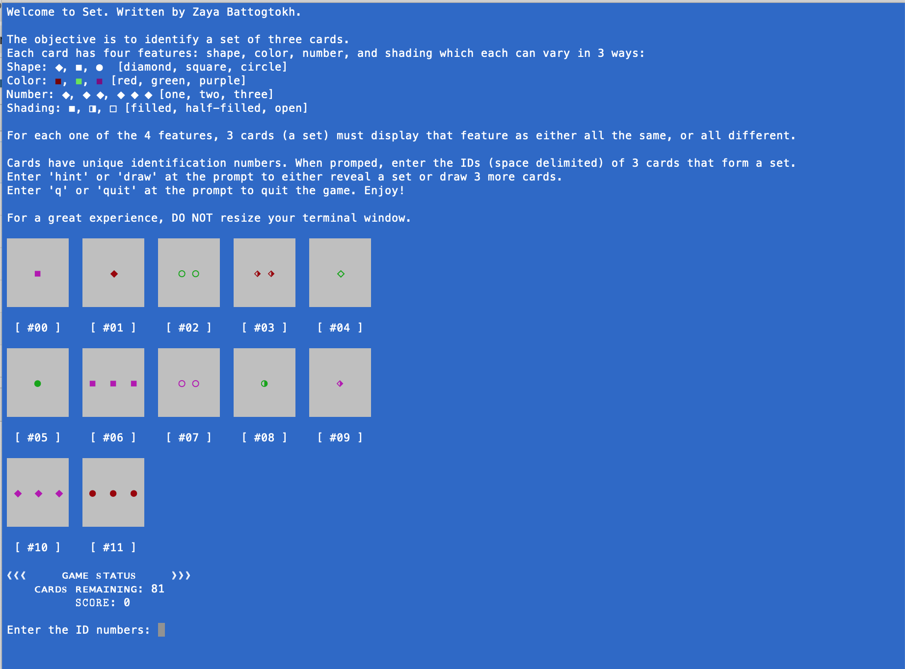

# Command Line Set

## Overview
A fun command line implementation of the popular card game Set. 

## Instructions 

1. Download/clone this repository
2. Set up and activate a `virtualenv`. 
3. Run `pip install -r requirements.text` 
4. Run `./main`
5. For best results, please do not resize the terminal window

## Rules 